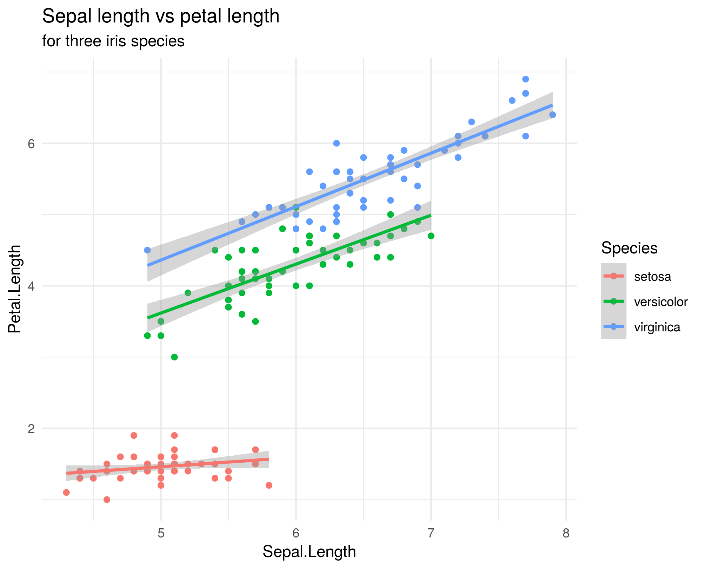
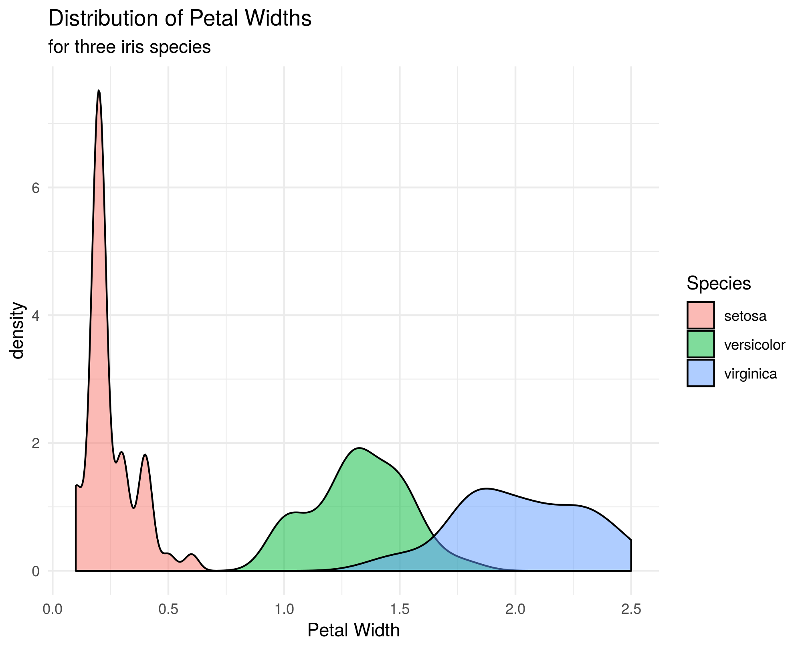
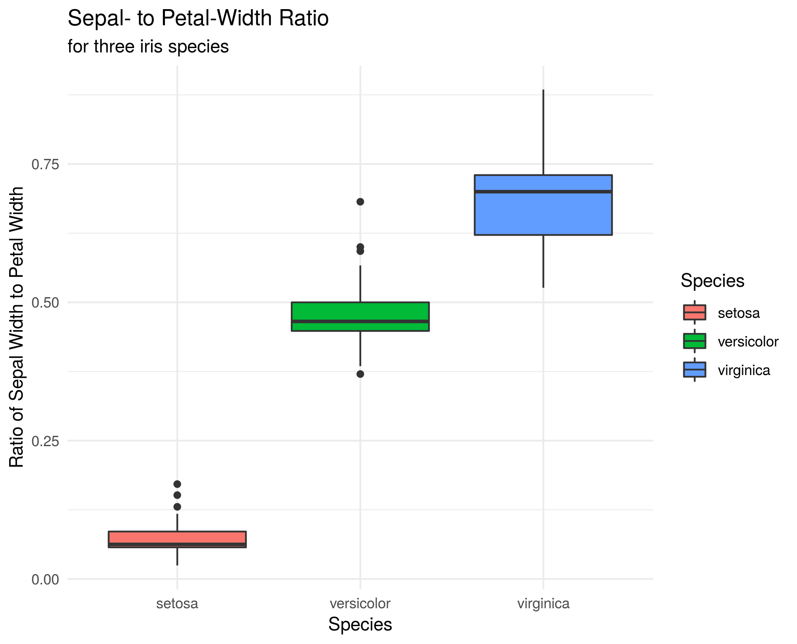
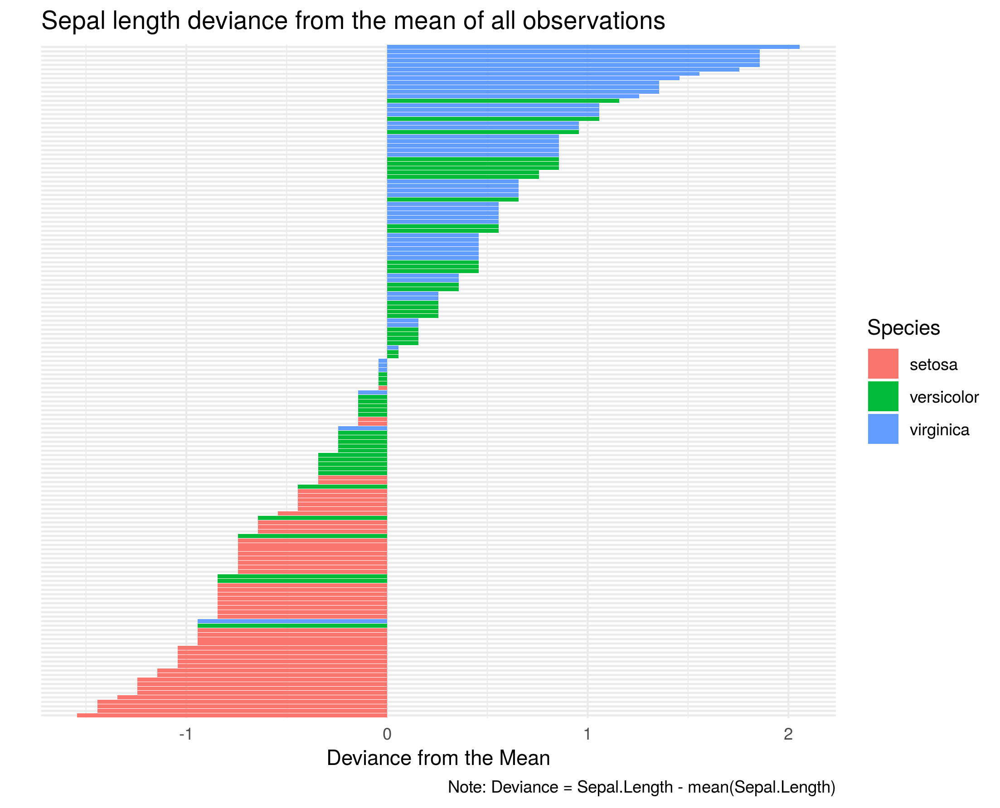

# **Assignment 5**

In this assignment you will:

+ Work through the introduction to the *ggplot2* package found in the R-script "Assignment_5.R"
+ Learn how to set up and modify a ggplot figure
+ Learn how to save your image to a custom file
+ Practice using ggplot to explore a data set by completing the assigned tasks below

**All file paths should be relative, starting from *your* Assignment_5 directory!!**

**This means that you need to create a new R-Project named "Assignment_5.Rproj" in your Assignment_5 directory, and work from scripts within that.**

__________

## **For credit ...**

1.  Upload an r-script named LASTNAME_ggplot.R to Canvas
2.  Push that same file to your GitHub repository along with any generated image files
3.  I should be able to pull your repository, run your LASTNAME_ggplot.R script and re-create all your images and files without errors

__________

We will work through an R script called [Assignment_5.R](https://gzahn.github.io/data-course/Repository/Assignments/Assignment_5/Assignment_5.html){target="_blank"} together during live class, pausing to understand what's going on as needed.

After you have grasped the basics of ggplot, complete the following tasks (in your new LASTNAME_ggplot.R file), generating nice-looking figures as directed:

1.  Load the "iris" data set
2.  Duplicate the first 3 figures below and save them in your Assignment_5 directory as "iris_fig1.png", "iris_fig2.png", "iris_fig3.png", respectively.
3.  Keep in mind that by default, I make most of my figures with theme_minimal() 
4.  Read through the different plot types on [this website](http://r-statistics.co/Top50-Ggplot2-Visualizations-MasterList-R-Code.html){target="_blank"} and use the info to reproduce the fourth figure below. Save it as "iris_fig4.png" (this is a great website to bookmark)

This last task requires you to use the internet to solve a tricky R task.  This is the most important skill you can learn in this course!
You'll probably have to figure out some functions you've not seen before and reconfigure them to the iris data. Yes, this is tricky. Yes, that's on purpose. The learning comes with figuring it out!

