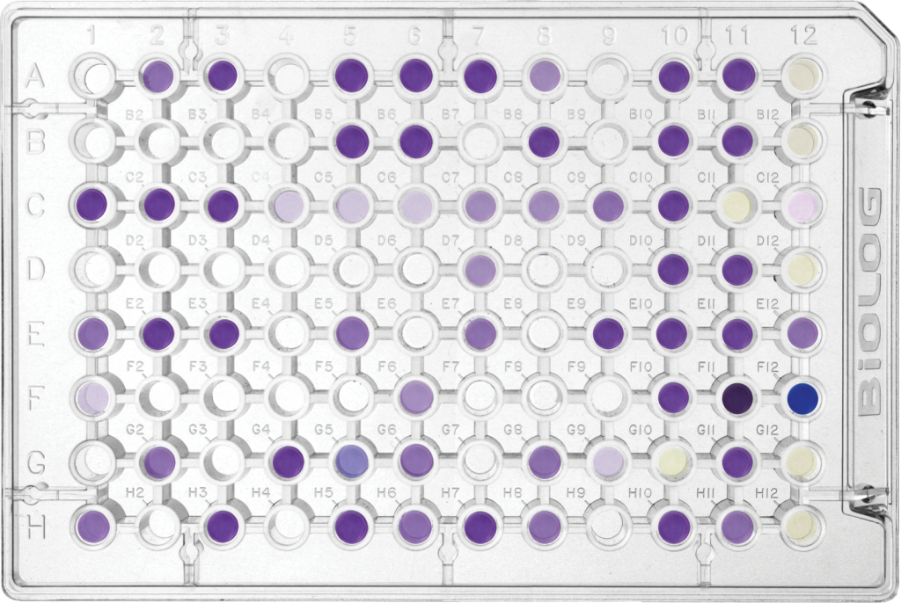

```{r setup, include=FALSE}
knitr::opts_chunk$set(echo = TRUE)
```

#### For this exam, I'm giving you a data set and asking you to run wild with it. I want an R-Markdown document that describes and analyses the data. I should be able to open your RProject, knit your Rmd to HTML and see a nice reproducible report that explores the data. **Your "knitted" HTML file doesn't have to *show* every single step, but it has to *perform* everything.** Make sure to include comments that explain the process. For example: If you take some cleaning actions, you can briefly describe them but then set the code to run in the background to avoid cluttering the final document. 

#### **Your completed HTML document should be able to stand on its own!**

___

#### You will need to use the following tools to answer questions about the data: 
+ summary statistics and visualizations of variables
+ visualizations of relationships between variables
+ modeling
+ statistical tests 
+ transformations, if needed

___

#### These data are from a "BioLog" machine. Essentially, you put diluted environmental samples into a plate that has a bunch of wells. In each well, there is a unique carbon substrate tagged to a dye. If the microbes in your environmental sample are capable of using that type of carbon substrate, the well will begin to change color. 

___



___


#### The BioLog machine reads light absorbtion values from each well over time. Higher values indicate more utilization of that carbon substrate. Values for substrates that are indistinguishable from values for water demonstrate that that particular substrate cannot be metabolized by the microbial community. This is a quick way of determining the functional potential of a microbial community without having to even know what microbes are present.

___

##### Here's a breakdown of the columns in the **"BioLogData_Exam3.csv"** data set:

| Column ID  |  Description                                                                              |
|------------|-------------------------------------------------------------------------------------------|
|  **Sample.ID** |  The location the sample was taken from. There are 2 water samples and 2 soil samples.    |
| **Rep**        |  The experimental replicate. 3 replicates for each combination of experimental variables. |
| **Well**       | The well number on the BioLog plate.                                                      |
| **Dilution**   | The dilution factor of the sample.                                                        |
| **Substrate**  | The name of the carbon source in that well.  "Water" is the negative control.                                             |
| **Hr_24**      | The light absorbance value after 24 hours of incubation.                                  |
| **Hr_48**      | The light absorbance value after 48 hours of incubation.                                  |
| **Hr_144**     | The light absorbance value after 144 hours of incubation.                                 |

___

##### Some of the stuff I want to know from these data...

+ Which sample locations are functionally different from each other in terms of what C-substrates they can utilize?
+ Are Soil and Water samples significantly different overall (as in, overall diversity of usable carbon sources)? What about for individual carbon substrates?
+ If there are differences between samples, which C-substrates are driving those differences?
+ Does the dilution factor change any of these answers?
+ Do the control samples indicate any contamination?

